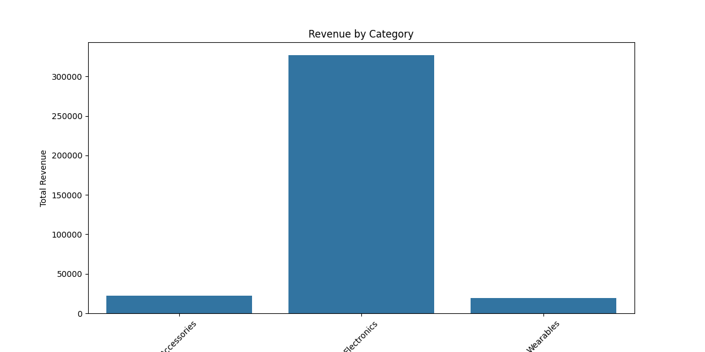

# E-commerce Sales Analysis Hackathon
by Ephraim Maina and Jacob Sihul

## Introduction
This project analyzes an E-commerce Sales and Customer Insights Dataset to uncover trends, answer key business questions, and create actionable insights. The analysis uses a combination of SQL, Python, and Power BI to provide comprehensive insights into sales patterns, customer behavior, and order fulfillment metrics.

## Data Cleaning Process

### Excel Data Cleaning and Standardization

#### 1. Removing Duplicates
Duplicate records were eliminated to ensure data accuracy using the following process:


**Steps Taken:**
1. Selected the entire dataset (Ctrl + A)
2. Used Data → Remove Duplicates feature
3. Selected all columns for duplicate checking
4. Verified results using Conditional Formatting → Highlight Duplicates
5. Documented the number of duplicates removed


#### 2. Handling Missing Data

##### A. Age Column (Using Median)
Missing values in the Age column were replaced with the median (47) to maintain data distribution:

**Steps Taken:**
1. Identified missing values using Conditional Formatting
2. Calculated median using `=MEDIAN(Age_Column)`
3. Replaced blank cells with the median value (47)
4. Verified data consistency after replacement

##### B. Shipping Status Column (Using Mode)
Missing shipping status values were filled with the most frequent value ("In Transit"):

**Steps Taken:**
1. Identified missing values in Shipping Status column
2. Determined mode using COUNTIF functions:
   ```excel
   =COUNTIF(ShippingStatus_Column, "In Transit")
   =COUNTIF(ShippingStatus_Column, "Delivered")
   =COUNTIF(ShippingStatus_Column, "Return")
   ```
3. Replaced blanks with "In Transit"
4. Verified categorical data consistency

#### 3. Date Standardization
Standardized all dates to YYYY-MM-DD format for consistency:

**Steps Taken:**
1. Selected the Date column
2. Applied Short Date format (YYYY-MM-DD)
3. Used Text to Columns for text-based dates
4. Verified date format consistency

### Results of Data Cleaning
- Removed duplicate entries: 0 duplicates found
- Standardized date formats across all records
- Filled missing values:
  * Age: Used median (47)
  * Shipping Status: Used mode ("In Transit")
- Verified data integrity after cleaning
- Then final cleaned data was then saved as cleaned_data.csv

### Database Setup
- Created SQLite database for efficient querying
- Implemented indexes for better query performance on frequently accessed columns
- Verified data integrity after import

## SQL Analysis

### 1. Total Sales by Region

- South region leads with $99,420 in total sales
- North follows closely with $97,210
- West region shows $92,400 in sales

### 2. Product Category Revenue

- Electronics dominates with $326,900 in total revenue
- Accessories follow with $22,610
- Wearables generate $19,000

### 3. Average Shipping Fee by Region

- West region has highest average shipping fee at $12.81
- East region averages $12.08
- South region at $12.08
- North region at $12.05

### 4. Customer Age Impact Analysis

- Over 45 age group shows highest total spent at $230,640
- 36-45 age group follows with $68,860
- 25-35 age group at $50,970
- Under 25 shows lowest spending at $18,040

### 5. Popular Products by Gender

- Female customers:
  - Electronics: $173,300
  - Accessories: $11,590
  - Wearables: $7,800
- Male customers:
  - Electronics: $153,600
  - Similar pattern in other categories

### 6. Order Fulfillment Analysis

- 91.01% orders in transit
- 4.85% orders returned
- 4.15% orders delivered

## Python Analysis

### Sales Visualization

- Interactive visualization showing regional sales distribution
- Highlights geographical sales patterns

### Category Revenue Analysis

- Detailed breakdown of revenue by product category
- Shows relative market share of each category

### Age-Purchase Correlation

- Correlation analysis between customer age and purchase amounts
- Identifies key age demographics

### Gender Category Analysis

- Cross-analysis of gender and category preferences
- Reveals purchasing patterns by gender

## Power BI Dashboard
[Coming Soon]
- Interactive dashboard with key metrics
- Regional sales analysis
- Product performance metrics
- Customer segmentation insights

## Conclusions and Recommendations

### Key Findings
1. **Regional Performance**
   - South and North regions are top performers
   - West region shows potential for growth

2. **Product Strategy**
   - Electronics category dominates revenue
   - Opportunity to boost Wearables sales

3. **Customer Demographics**
   - Older customers (45+) show highest spending
   - Potential to engage younger demographics

4. **Shipping and Fulfillment**
   - High percentage of in-transit orders
   - Room for improvement in delivery times


## Project Structure
```
E-commerce-Sales-Analysis-Hackathon/
├── data/
│   ├── raw/
│   │   └── e-commerce-sales-and-customer-insights-dataset.xlsx    # Original dataset
│   ├── cleaned/
│   │   ├── cleaned_data.csv                                      # Excel cleaned data
│   │   └── database.db                                           # SQLite database
│   ├── sql_results/
│   │   ├── 1._total_sales_by_region.png
│   │   ├── 2._product_category_revenue_analysis.png
│   │   ├── 3._average_shipping_fee_by_region.png
│   │   ├── 4._customer_age_impact_analysis.png
│   │   ├── 5._popular_products_by_gender.png
│   │   └── 6._order_fulfillment_analysis.png
│   └── python_results/
│       ├── sales_by_region.png
│       ├── category_revenue.png
│       ├── age_purchase_correlation.png
│       └── gender_category_revenue.png
│
├── sql/
│   ├── create_tables.sql                                         # Database schema
│   ├── data_cleaning.sql                                         # SQL cleaning queries
│   └── analysis_queries.sql                                      # Analysis queries
│
├── python/
│   ├── requirements.txt                                          # Python dependencies
│   ├── data_preprocessing.py                                     # Data preparation
│   ├── customer_frequency_analysis.py                            # Customer analysis
│   ├── product_analysis.py                                       # Product analysis
│   └── visualization.py                                          # Visualization scripts
│
├── powerbi/
│   ├── E-commerce_Analysis.pbix                                  # Main dashboard file
│   ├── Executive_Dashboard.pdf                                   # Dashboard exports
│   ├── Product_Analysis_Dashboard.pdf
│   ├── Customer_Insights_Dashboard.pdf
│   └── Operational_Metrics_Dashboard.pdf
│
├── docs/
│   ├── data_dictionary.md                                        # Data definitions
│   ├── analysis_methodology.md                                   # Analysis approach
│   └── visualization_guide.md                                    # Dashboard guide
│
├── scripts/
│   ├── setup.sh                                                  # Setup script
│   └── run_analysis.sh                                          # Analysis pipeline
│
├── .gitignore                                                    # Git ignore file
├── LICENSE                                                       # Project license
└── README.md                                                     # Project documentation
```

### Directory Descriptions

#### `/data`
- `raw/`: Original dataset files
- `cleaned/`: Processed and cleaned data
- `sql_results/`: SQL analysis outputs and visualizations
- `python_results/`: Python analysis outputs and visualizations

#### `/sql`
- SQL scripts for database creation, data cleaning, and analysis
- Organized queries for each analysis requirement

#### `/python`
- Python scripts for data analysis and visualization
- Includes requirements.txt for dependency management

#### `/powerbi`
- Power BI dashboard files and exports
- Separate dashboards for different analysis aspects

#### `/docs`
- Documentation files explaining data, methodology, and visualizations
- Guides for understanding and using the analysis

#### `/scripts`
- Automation scripts for setup and analysis
- Ensures reproducibility of results

## Tools Used
- Excel: Initial data cleaning and exploration
- SQL (SQLite): Data analysis and querying
- Python: Advanced analysis and visualization
- Power BI: Interactive dashboard creation

## Getting Started
1. Clone this repository
2. Install required Python packages: `pip install -r requirements.txt`
3. Run the analysis pipeline:
```bash
run_analysis.bat
```
4. Open the Power BI dashboard for interactive exploration
```
\powerbi\Power_BI_Dashboard.pbix
```
   # Screen Shots from the Power BI dashBoard

  ##Executive Overview


   ##Product Analysis Overview


   ##Customer Insights Overview


   ##Operation Metrics Overview


# E-commerce Sales Analysis Hackathon


This project is part of the Data Analysis Hackathon 2025. 
