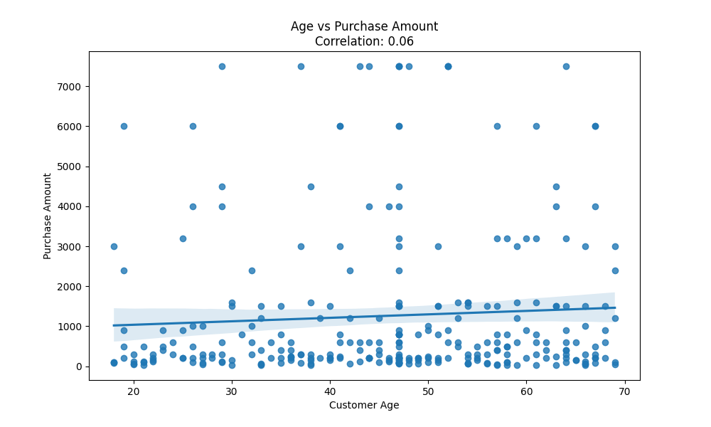

<<<<<<< HEAD
# E-commerce Sales Analysis Hackathon

## Introduction
This project analyzes an E-commerce Sales and Customer Insights Dataset to uncover trends, answer key business questions, and create actionable insights. The analysis uses a combination of SQL, Python, and Power BI to provide comprehensive insights into sales patterns, customer behavior, and order fulfillment metrics.

## Data Cleaning Process

### Initial Data Cleaning
- Standardized column names to lowercase with underscores
- Handled missing values in the dataset
- Standardized date formats
- Removed any duplicate entries

### Database Setup
- Created SQLite database for efficient querying
- Implemented indexes for better query performance on frequently accessed columns
- Verified data integrity after import

## SQL Analysis

### 1. Total Sales by Region

- South region leads with $99,420 in total sales
- North follows closely with $97,210
- West region shows $92,400 in sales

### 2. Product Category Revenue

- Electronics dominates with $326,900 in total revenue
- Accessories follow with $22,610
- Wearables generate $19,000

### 3. Average Shipping Fee by Region

- West region has highest average shipping fee at $12.81
- East region averages $12.08
- South region at $12.08
- North region at $12.05

### 4. Customer Age Impact Analysis

- Over 45 age group shows highest total spent at $230,640
- 36-45 age group follows with $68,860
- 25-35 age group at $50,970
- Under 25 shows lowest spending at $18,040

### 5. Popular Products by Gender

- Female customers:
  - Electronics: $173,300
  - Accessories: $11,590
  - Wearables: $7,800
- Male customers:
  - Electronics: $153,600
  - Similar pattern in other categories

### 6. Order Fulfillment Analysis

- 91.01% orders in transit
- 4.85% orders returned
- 4.15% orders delivered

## Python Analysis

### Sales Visualization

- Interactive visualization showing regional sales distribution
- Highlights geographical sales patterns

### Category Revenue Analysis

- Detailed breakdown of revenue by product category
- Shows relative market share of each category

### Age-Purchase Correlation

- Correlation analysis between customer age and purchase amounts
- Identifies key age demographics

### Gender Category Analysis

- Cross-analysis of gender and category preferences
- Reveals purchasing patterns by gender

## Power BI Dashboard
[Coming Soon]
- Interactive dashboard with key metrics
- Regional sales analysis
- Product performance metrics
- Customer segmentation insights

## Conclusions and Recommendations

### Key Findings
1. **Regional Performance**
   - South and North regions are top performers
   - West region shows potential for growth

2. **Product Strategy**
   - Electronics category dominates revenue
   - Opportunity to boost Wearables sales

3. **Customer Demographics**
   - Older customers (45+) show highest spending
   - Potential to engage younger demographics

4. **Shipping and Fulfillment**
   - High percentage of in-transit orders
   - Room for improvement in delivery times

### Recommendations
1. **Sales Strategy**
   - Implement targeted marketing in West region
   - Develop special promotions for under-performing categories

2. **Customer Engagement**
   - Create targeted campaigns for younger customers
   - Develop loyalty programs for high-value age groups

3. **Operations**
   - Review shipping processes to reduce transit times
   - Investigate causes of returns to reduce return rate

4. **Product Development**
   - Focus on expanding electronics category
   - Consider new products in wearables category

## Next Steps
1. Complete Power BI dashboard implementation
2. Conduct deeper analysis of return patterns
3. Develop detailed customer segmentation
4. Create automated reporting system

## Project Structure
```
E-commerce-Sales-Analysis-Hackathon/
├── data/                      # Dataset files
│   ├── cleaned_data.csv      # Cleaned dataset
│   ├── sql_results/          # SQL analysis results
│   └── python_results/       # Python analysis visualizations
├── sql/                      # SQL analysis files
│   └── SQL_Analysis_Queries.sql
├── python/                   # Python analysis files
│   ├── export_to_db.py
│   ├── run_sql_analysis.py
│   └── analysis.py
├── powerbi/                  # Power BI dashboard files
│   └── PowerBI_Analysis_Dashboard.pbix
└── README.md                 # Project documentation
```

## Tools Used
- Excel: Initial data cleaning and exploration
- SQL (SQLite): Data analysis and querying
- Python: Advanced analysis and visualization
- Power BI: Interactive dashboard creation

## Getting Started
1. Clone this repository
2. Install required Python packages: `pip install -r requirements.txt`
3. Run the analysis pipeline:
   ```bash
   python python/export_to_db.py
   python python/run_sql_analysis.py
   python python/analysis.py
   ```
4. Open the Power BI dashboard for interactive exploration

## Contributing
This project is part of the Data Analysis Hackathon 2025 at the University of Eastern Africa, Baraton Department of Information Systems and Computing.

## License
=======
# E-commerce Sales Analysis Hackathon

## Introduction
This project analyzes an E-commerce Sales and Customer Insights Dataset to uncover trends, answer key business questions, and create actionable insights. The analysis uses a combination of SQL, Python, and Power BI to provide comprehensive insights into sales patterns, customer behavior, and order fulfillment metrics.

## Data Cleaning Process

### Initial Data Cleaning
- Standardized column names to lowercase with underscores
- Handled missing values in the dataset
- Standardized date formats
- Removed any duplicate entries

### Database Setup
- Created SQLite database for efficient querying
- Implemented indexes for better query performance on frequently accessed columns
- Verified data integrity after import

## SQL Analysis

### 1. Total Sales by Region

- South region leads with $99,420 in total sales
- North follows closely with $97,210
- West region shows $92,400 in sales

### 2. Product Category Revenue

- Electronics dominates with $326,900 in total revenue
- Accessories follow with $22,610
- Wearables generate $19,000

### 3. Average Shipping Fee by Region

- West region has highest average shipping fee at $12.81
- East region averages $12.08
- South region at $12.08
- North region at $12.05

### 4. Customer Age Impact Analysis

- Over 45 age group shows highest total spent at $230,640
- 36-45 age group follows with $68,860
- 25-35 age group at $50,970
- Under 25 shows lowest spending at $18,040

### 5. Popular Products by Gender

- Female customers:
  - Electronics: $173,300
  - Accessories: $11,590
  - Wearables: $7,800
- Male customers:
  - Electronics: $153,600
  - Similar pattern in other categories

### 6. Order Fulfillment Analysis

- 91.01% orders in transit
- 4.85% orders returned
- 4.15% orders delivered

## Python Analysis

### Sales Visualization

- Interactive visualization showing regional sales distribution
- Highlights geographical sales patterns

### Category Revenue Analysis

- Detailed breakdown of revenue by product category
- Shows relative market share of each category

### Age-Purchase Correlation

- Correlation analysis between customer age and purchase amounts
- Identifies key age demographics

### Gender Category Analysis

- Cross-analysis of gender and category preferences
- Reveals purchasing patterns by gender

## Power BI Dashboard
[Coming Soon]
- Interactive dashboard with key metrics
- Regional sales analysis
- Product performance metrics
- Customer segmentation insights

## Conclusions and Recommendations

### Key Findings
1. **Regional Performance**
   - South and North regions are top performers
   - West region shows potential for growth

2. **Product Strategy**
   - Electronics category dominates revenue
   - Opportunity to boost Wearables sales

3. **Customer Demographics**
   - Older customers (45+) show highest spending
   - Potential to engage younger demographics

4. **Shipping and Fulfillment**
   - High percentage of in-transit orders
   - Room for improvement in delivery times

### Recommendations
1. **Sales Strategy**
   - Implement targeted marketing in West region
   - Develop special promotions for under-performing categories

2. **Customer Engagement**
   - Create targeted campaigns for younger customers
   - Develop loyalty programs for high-value age groups

3. **Operations**
   - Review shipping processes to reduce transit times
   - Investigate causes of returns to reduce return rate

4. **Product Development**
   - Focus on expanding electronics category
   - Consider new products in wearables category

## Next Steps
1. Complete Power BI dashboard implementation
2. Conduct deeper analysis of return patterns
3. Develop detailed customer segmentation
4. Create automated reporting system

## Project Structure
```
E-commerce-Sales-Analysis-Hackathon/
├── data/                      # Dataset files
│   ├── cleaned_data.csv      # Cleaned dataset
│   ├── sql_results/          # SQL analysis results
│   └── python_results/       # Python analysis visualizations
├── sql/                      # SQL analysis files
│   └── SQL_Analysis_Queries.sql
├── python/                   # Python analysis files
│   ├── export_to_db.py
│   ├── run_sql_analysis.py
│   └── analysis.py
├── powerbi/                  # Power BI dashboard files
│   └── PowerBI_Analysis_Dashboard.pbix
└── README.md                 # Project documentation
```

## Tools Used
- Excel: Initial data cleaning and exploration
- SQL (SQLite): Data analysis and querying
- Python: Advanced analysis and visualization
- Power BI: Interactive dashboard creation

## Getting Started
1. Clone this repository
2. Install required Python packages: `pip install -r requirements.txt`
3. Run the analysis pipeline:
   ```bash
   python python/export_to_db.py
   python python/run_sql_analysis.py
   python python/analysis.py
   ```
4. Open the Power BI dashboard for interactive exploration

## Contributing
This project is part of the Data Analysis Hackathon 2025 at the University of Eastern Africa, Baraton Department of Information Systems and Computing.

## License
>>>>>>> c14cfc7 (Initial commit)
This project is part of the Data Analysis Hackathon 2025. 